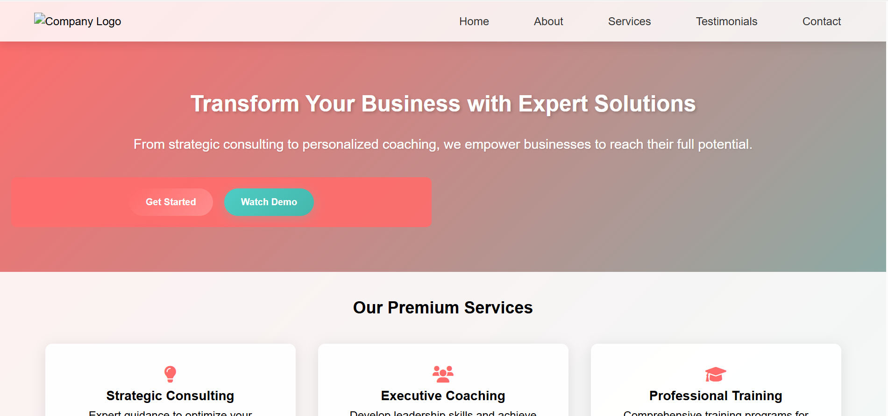
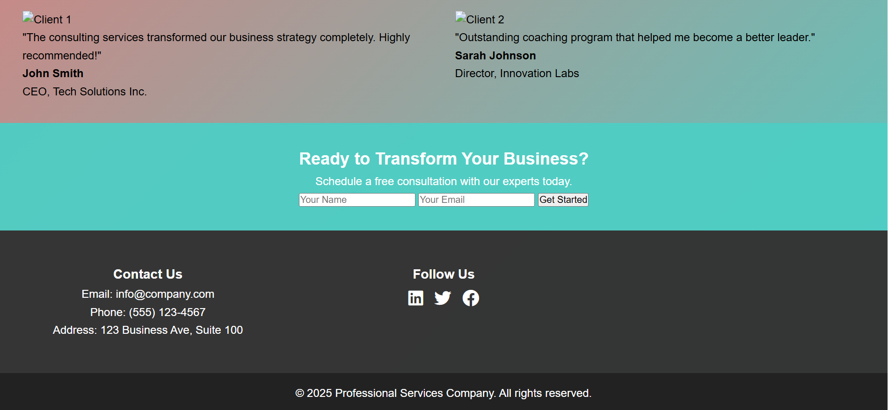

## 🚀 Service-Based Landing Page

A modern, responsive, and visually appealing landing page for service-based businesses. Built with **HTML, CSS, and Font Awesome**, this template is perfect for showcasing services, testimonials, and calls-to-action. 🎯✨

---

### 📂 Project Features

* ✅ Mobile-first responsive layout
* ✅ Beautiful gradients & hover effects
* ✅ Service cards with icons
* ✅ Testimonials section
* ✅ Call-to-action form
* ✅ Clean and modern footer

---

### 📸 Preview

 
 

---

### 🛠 How to Use

1. Clone or download this repo
2. Open `index.html` in your browser
3. Customize content, links, or styles as needed

---

### 🧾 Tech Stack

* HTML5
* CSS3
* Font Awesome
* Responsive Design (Media Queries)

### 🙌 Contributing

Feel free to fork this repo and create a pull request if you have ideas to improve it.
Author: Muzamil-Fatima
